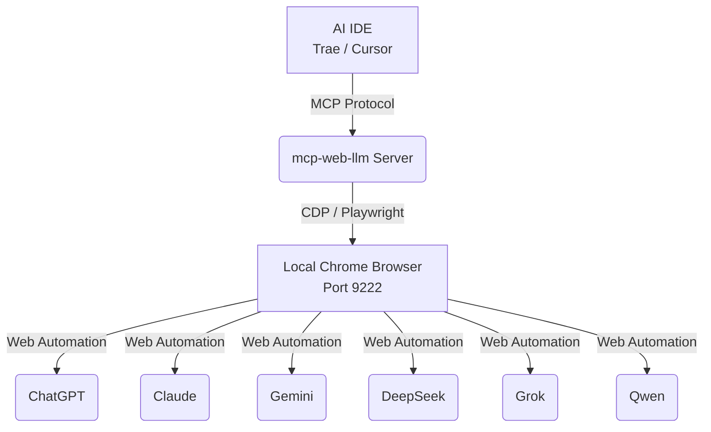

<div align="center">
  
</div>

# MCP Web LLM Aggregator

**English** | [中文](README_zh.md)

A **Zero-Cost, Non-API** MCP Server that aggregates web versions of **ChatGPT**, **Claude**, **Gemini**, **DeepSeek**, **Grok**, and **Qwen**.

Query multiple top-tier models in parallel directly from your AI IDE (Trae, Cursor, etc.) using your local browser sessions. **No API keys or tokens required.**

## Features

- **Multi-Model Aggregation**: The `ask_all` tool queries all supported models simultaneously and returns a consolidated JSON response.
- **File/Image Upload**: Supports local file paths and inline base64 images, then uploads them to supported model web UIs through Playwright.
- **Supported Models**: 
  - ChatGPT (chatgpt.com)
  - Claude (claude.ai)
  - Gemini (gemini.google.com)
  - DeepSeek (chat.deepseek.com)
  - Grok (grok.com)
  - Qwen (chat.qwen.ai)
- **No API Tokens**: Leverages the free web interfaces of these models.
- **Browser Automation**: Uses Playwright and CDP to connect to your existing Chrome instance, reusing your login state.
- **Cost Saving**: Perfect for developers who want high-quality model outputs without the API costs.
- **No Long-Term Memory Feature**: The previous experimental memory/session feature has been rolled back. The project currently only keeps a simple local chat history.

## Demo

[Demo video (MP4)](demo/demo.mp4)

## Tools

- `ask_chatgpt(query: str, file_paths?: list[str], images_base64?: list[str]) -> str`
- `ask_claude(query: str, file_paths?: list[str], images_base64?: list[str]) -> str`
- `ask_gemini(query: str, file_paths?: list[str], images_base64?: list[str]) -> str`
- `ask_deepseek(query: str, file_paths?: list[str], images_base64?: list[str]) -> str`
- `ask_grok(query: str, file_paths?: list[str], images_base64?: list[str]) -> str`
- `ask_qwen(query: str, file_paths?: list[str], images_base64?: list[str]) -> str`
- `ask_all(query: str, file_paths?: list[str], images_base64?: list[str]) -> str` returns a JSON string with keys: `chatgpt/claude/gemini/deepseek/grok/qwen`

### File Input Notes

- `file_paths`: absolute local file paths, suitable for files already saved on disk.
- `images_base64`: inline image payloads from IDE attachments or clipboard screenshots; the server writes them to a temporary local file before upload.
- If your IDE cannot pass structured file arguments, you can also place an absolute local path directly inside `query`, and the server will try to auto-extract it.

## Usage

### 0. Install (Recommended)

Install as a CLI so you don't need to clone the repo:

```bash
uv tool install git+https://github.com/HGD-coder/mcp-web-llm.git
```

> **Windows Users Note:** If you encounter permission errors during installation (e.g., `os error -2147024891`), please use the `--link-mode=copy` flag:
> ```bash
> uv tool install git+https://github.com/HGD-coder/mcp-web-llm.git --link-mode=copy
> ```

### 1. Prerequisites

This project uses `uv` for dependency management. Run in the project root:
```bash
uv sync
```

### 2. Prepare Chrome Browser

You need a dedicated Chrome window for AI conversations. We use "Connect over CDP" mode to avoid bans and CAPTCHAs.

**Windows:**
Run in PowerShell (change path if needed):
```powershell
& "C:\Program Files\Google\Chrome\Application\chrome.exe" --remote-debugging-port=9222 --user-data-dir="C:\chrome_debug_profile" --disable-blink-features=AutomationControlled
```

**macOS:**
```bash
/Applications/Google\ Chrome.app/Contents/MacOS/Google\ Chrome --remote-debugging-port=9222 --user-data-dir="$HOME/chrome_debug_profile" --disable-blink-features=AutomationControlled
```

**After running:**
1. A new Chrome window will pop up.
2. Open and **log in** to these sites in tabs:
   - ChatGPT: [https://chatgpt.com](https://chatgpt.com)
   - Claude: [https://claude.ai](https://claude.ai)
   - Gemini: [https://gemini.google.com](https://gemini.google.com)
   - DeepSeek: [https://chat.deepseek.com](https://chat.deepseek.com)
   - Grok: [https://grok.com](https://grok.com)
   - Qwen: [https://chat.qwen.ai](https://chat.qwen.ai)
3. **Do not close this window!** Keep it running in the background.

### 3. Configure IDE (Trae/Cursor)

Add to your `mcp-servers.json`:

```json
{
  "mcpServers": {
    "web-llm-agent": {
      "command": "mcp-web-llm",
      "args": [],
      "env": {
        "PYTHONIOENCODING": "utf-8"
      }
    }
  }
}
```

If you run from source instead:

```json
{
  "mcpServers": {
    "web-llm-agent": {
      "command": "uv",
      "args": ["run", "server.py"],
      "cwd": "/path/to/mcp-web-llm",
      "env": { "PYTHONIOENCODING": "utf-8" }
    }
  }
}
```

### 4. Start Using

In your IDE chat, use natural language:
- "Use `ask_all` to compare Vue vs React."
- "Ask Claude to write a Python script."

## Architecture



## Contributing

Contributions are welcome! If you'd like to add support for a new model or improve the existing automation scripts:
1. Fork the repository.
2. Create a new branch for your feature or bug fix.
3. Submit a pull request with a detailed description of your changes.
Please make sure to test your changes locally using `uv run server.py`.

## Troubleshooting

- CDP (9222) not running: run `mcp-web-llm doctor` to see status; on Windows the server can auto-launch a dedicated Chrome window.
- Timeouts/no output: usually login required, CAPTCHA/rate limit, or site UI changes; try keeping the dedicated Chrome window open and logged in.

## Security & Privacy

- Uses your local Chrome session via CDP; it can access pages you have logged into in that dedicated Chrome profile.
- This project does not require API keys or tokens, but website terms and anti-bot systems may apply; use at your own risk.

## License

MIT. See [LICENSE](LICENSE).
