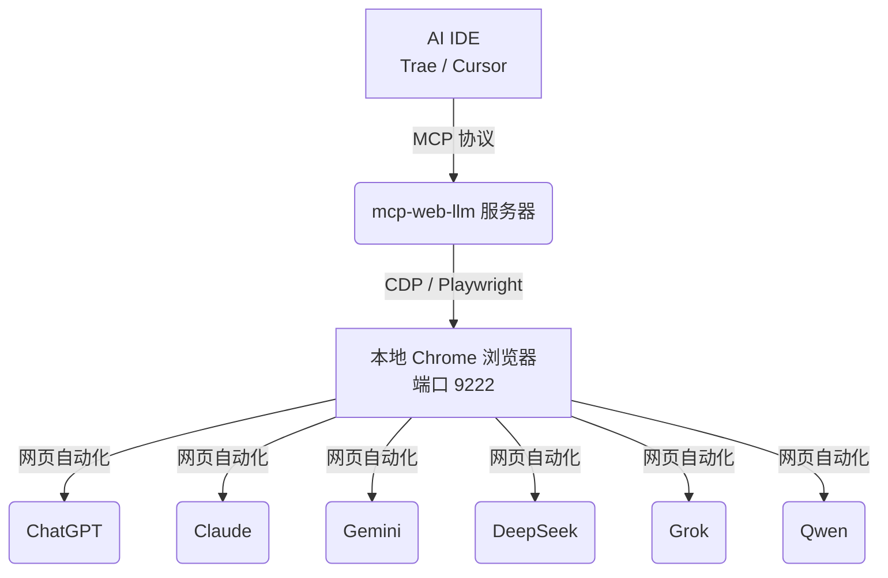

<div align="center">
  
</div>

# MCP Web LLM Aggregator (中文版)

[English](README.md) | **中文**

一个 **零成本、非 API** 的 MCP 服务器，聚合了 **ChatGPT**、**Claude**、**Gemini**、**DeepSeek**、**Grok** 和 **Qwen** 的网页版。

在您的 AI IDE（如 Trae、Cursor）中，直接利用本地浏览器会话，并行查询多个顶级模型。**无需 API Key，无需 Token。**

## 核心功能

- **多模型聚合**：`ask_all` 工具同时询问所有支持的模型，并返回汇总的 JSON 结果。
- **文件/图片上传**：支持本地文件路径与内联 base64 图片，并通过 Playwright 上传到各模型网页端。
- **支持的模型**：
  - ChatGPT (chatgpt.com)
  - Claude (claude.ai)
  - Gemini (gemini.google.com)
  - DeepSeek (chat.deepseek.com)
  - Grok (grok.com)
  - Qwen (chat.qwen.ai)
- **无需 API Token**：直接利用这些模型的免费网页版接口。
- **浏览器自动化**：使用 Playwright 和 CDP 连接到您现有的 Chrome 实例，复用您的登录状态。
- **极致省钱**：适合希望获得高质量模型输出但不想支付 API 费用的开发者。
- **没有长期记忆功能**：之前实验性的 memory/session 功能已经回滚，当前只保留简单的本地聊天历史记录。

## 演示

[演示视频 (MP4)](demo/demo.mp4)

## 工具列表

- `ask_chatgpt(query: str, file_paths?: list[str], images_base64?: list[str]) -> str`
- `ask_claude(query: str, file_paths?: list[str], images_base64?: list[str]) -> str`
- `ask_gemini(query: str, file_paths?: list[str], images_base64?: list[str]) -> str`
- `ask_deepseek(query: str, file_paths?: list[str], images_base64?: list[str]) -> str`
- `ask_grok(query: str, file_paths?: list[str], images_base64?: list[str]) -> str`
- `ask_qwen(query: str, file_paths?: list[str], images_base64?: list[str]) -> str`
- `ask_all(query: str, file_paths?: list[str], images_base64?: list[str]) -> str` 返回 JSON 字符串（包含 `chatgpt/claude/gemini/deepseek/grok/qwen` 六个字段）

### 文件输入说明

- `file_paths`：本地绝对路径，适合已经落盘的文件。
- `images_base64`：适合 IDE 附件或剪贴板截图；服务端会先写入临时文件，再走现有上传链路。
- 如果 IDE 暂时无法传结构化文件参数，也可以把本地绝对路径直接写进 `query`，服务端会尝试自动提取。

## 使用指南

### 0. 安装（推荐）

推荐使用 CLI 安装，这样无需 clone 仓库：

```bash
uv tool install git+https://github.com/HGD-coder/mcp-web-llm.git
```

> **Windows 用户注意：** 如果安装时遇到权限报错（如 `os error -2147024891`），请添加 `--link-mode=copy` 参数：
> ```bash
> uv tool install git+https://github.com/HGD-coder/mcp-web-llm.git --link-mode=copy
> ```

### 1. 环境准备

本项目使用 `uv` 管理依赖。请在项目根目录下运行：
```bash
uv sync
```

### 2. 准备 Chrome 浏览器

你需要一个专门用于 AI 对话的 Chrome 窗口。为了避免封号和验证码，我们使用“接管模式” (Connect over CDP)。

**Windows 用户:**
请在 PowerShell 中运行（注意修改您的 Chrome 路径）：
```powershell
& "C:\Program Files\Google\Chrome\Application\chrome.exe" --remote-debugging-port=9222 --user-data-dir="C:\chrome_debug_profile" --disable-blink-features=AutomationControlled
```

**macOS 用户:**
```bash
/Applications/Google\ Chrome.app/Contents/MacOS/Google\ Chrome --remote-debugging-port=9222 --user-data-dir="$HOME/chrome_debug_profile" --disable-blink-features=AutomationControlled
```

**运行后：**
1. 会弹出一个全新的 Chrome 窗口。
2. 在这个窗口里，分别打开以下网站并**登录你的账号**：
   - ChatGPT: [https://chatgpt.com](https://chatgpt.com)
   - Claude: [https://claude.ai](https://claude.ai)
   - Gemini: [https://gemini.google.com](https://gemini.google.com)
   - DeepSeek: [https://chat.deepseek.com](https://chat.deepseek.com)
   - Grok: [https://grok.com](https://grok.com)
   - Qwen: [https://chat.qwen.ai](https://chat.qwen.ai)
3. **不要关闭这个窗口！** 把它最小化放在后台即可。

### 3. 配置 IDE (Trae/Cursor)

在您的 `mcp-servers.json` 中添加以下配置：

```json
{
  "mcpServers": {
    "web-llm-agent": {
      "command": "mcp-web-llm",
      "args": [],
      "env": {
        "PYTHONIOENCODING": "utf-8"
      }
    }
  }
}
```

如果你选择从源码运行：

```json
{
  "mcpServers": {
    "web-llm-agent": {
      "command": "uv",
      "args": ["run", "server.py"],
      "cwd": "D:\\path\\to\\mcp-web-llm",
      "env": { "PYTHONIOENCODING": "utf-8" }
    }
  }
}
```

### 4. 开始使用

在 IDE 的对话框中，直接使用自然语言调用工具：
- “请使用 `ask_all` 工具，让它们分别对比一下 Vue 和 React，并给我一个汇总建议。”
- “让 `ask_claude` 帮我写一个 Python 爬虫脚本。”

## 架构说明



## 贡献指南

欢迎任何形式的贡献！如果您希望添加对新模型的支持或改进现有的自动化脚本：
1. Fork 本仓库。
2. 为您的功能或错误修复创建一个新分支。
3. 提交 Pull Request，并附上您所做更改的详细说明。
在提交之前，请确保使用 `uv run server.py` 在本地测试您的更改。

## 排障指南

- 9222 未开启：运行 `mcp-web-llm doctor` 查看状态；Windows 下可自动拉起一个专用 Chrome 窗口。
- 超时/无输出：通常是未登录、验证码/风控、或站点页面结构更新导致；建议保持专用 Chrome 窗口常驻并登录。

## 安全与隐私

- 本项目通过 CDP 接管本地 Chrome 会话；它能访问该专用 profile 中你已登录的网站页面。
- 本项目不需要 API Key/Token，但网页版条款与反爬机制可能会限制使用；请自行评估风险。

## 许可证

MIT，详见 [LICENSE](LICENSE)。
